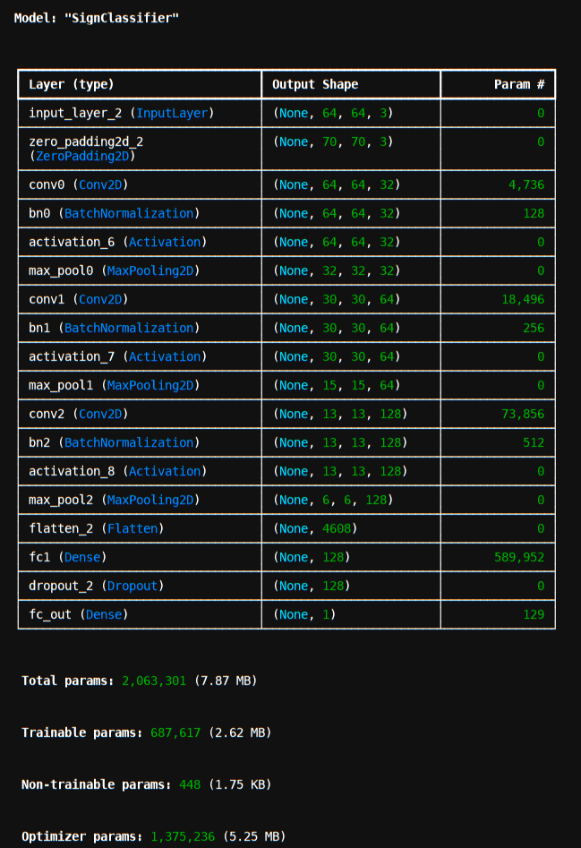

# Happy Model API 🎉

A FastAPI application that serves a TensorFlow/Keras model (`happy.keras`) for image-based predictions. 
The API accepts `.jpg` images, preprocesses them, and returns a binary classification result.

---

## Installation

1. **Clone the repository** 
    ```bash
    git clone https://github.com/yourusername/happy-model-api.git
    cd happy-model-api
    ```
   
2. **Create a virtual environment (recommended)** 
    ```bash
    python3 -m venv venv
    source venv/bin/activate   # Linux/Mac
    venv\Scripts\activate      # Windows
    ```
    
3. **Install dependencies**
    ```bash
    pip install -r requirements.txt
    ```

4. **Deployment**
    ```bash
    uvicorn main_api:app --reload
    # or for deploy
    uvicorn main_api:app --host 0.0.0.0 --port 8000 --workers 4
    ```
    
5. **Modeling info**

    
    - Model file: model/happy.keras
    - Framework: TensorFlow / Keras
    - Expected input: RGB .jpg image
    - Output:
    - Binary classification (0 or 1)
    - Prediction threshold: 0.5
    
5. **Endpoints**
    POST
    - /happymodel/{image}
    OUTPUT
    - {"prediction": <integer 0 or 1>}
    
6. **Example Usage**
    ```bash
    curl -X POST "http://127.0.0.1:8000/happymodel/" -F "file=@example.jpg"
    ```
